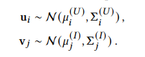

# Reproduction: Probabilistic Metric Learning with Adaptive Margin for Top-K Recommendation

## 介绍

本项目旨在复现论文[Probabilistic Metric Learning with Adaptive Margin for Top-K Recommendation](https://arxiv.org/pdf/2101.04849)的相关代码，使用PaddlePaddle进行代码的构建，并对来自[Amazon Review Dataset](https://nijianmo.github.io/amazon/index.html)的Books、CDs两个数据集进行测试。

在信息爆炸时代，用户面临海量在线内容和服务的选择困难，个性化推荐系统成为缓解信息过载的关键工具。其核心任务是通过用户历史行为（如点击、购买）预测用户偏好，并为每个用户生成个性化的Top-K推荐列表（即推荐用户最可能感兴趣的K个物品）。这一任务要求模型不仅需准确捕捉用户-物品交互关系，还需保证推荐结果的多样性和可解释性。


论文提出了一种概率度量学习模型PMLAM，其核心贡献包括：
- 通过高斯分布表示用户和物品，捕捉嵌入的不确定性；
- 将边距生成建模为双层优化问题，动态生成边距；
- 显式建模用户-用户和物品-物品关系，提升推荐性能。

## 数据集

原论文使用[Amazon Review Dataset](https://nijianmo.github.io/amazon/index.html)数据集。Amazon Review Dataset数据集收录了亚马逊平台上用户对商品的评价信息，涵盖图书、电子产品、影视、音乐等33个商品类别常用于：
1. 推荐系统
    - 基于用户历史评论预测下一个可能的商品购买（序列推荐）；
    - 多个用户共同购买图谱的构建以及优化关联推荐。
2. 自然语言处理
    - 根据评论文本预测评分；
    - 分析评论真实性。
3. 用户行为研究
    - 结合用户的评价时间、物品价格等因素，研究消费市场周期性与商品热度关系；
    - 从差评中分析提取产品改进设计。
    
在Amazon Review Dataset中，我们依照原论文选择Books、CDs两个数据集，且选用`Rating-only`数据集。数据集的形式如下：

| Item | User | Rating  | Timestamp |
|:------------:|:-----------:|:------------:|:------------:|
| 1713353 |A1C6M8LCIX4M6M | 5.0  |1123804800|
| 0060786817  | A5EXND10WD4PM  | 3.0  | 1137542400|

其中`item`为物品编号，`user`为用户标识，`rating`为用户对物品给出的评分，`timestamp`为用户进行评价的时间标记。

## Top-K推荐下的自适应边距概率度量学习

### 相关依赖

在本项目中，我们采用PaddlePaddle进行代码复现

相关依赖已经在`requirements.txt`中给出

### 研究方法

模型的整体框图见下：


1. Wasserstein距离

    用户和物品分别表示为高斯分布：

    

    采用Wasserstein距离衡量用户-物品偏好：

    

2. 自适应边距（Margin）生成

    将边距生成建模为双层优化问题：
    - 内层优化：固定边距参数，优化模型参数；
    - 外层优化：固定模型参数，优化边距生成函数。

    边距生成函数通过神经网络实现，输入为三元组的嵌入差异，输出为动态边距。采用如下损失函数进行训练：

    

3. 用户-用户与物品-物品关系
   
   通过余弦相似度筛选相似用户/物品，并引入边距排名损失，迫使相似用户或物品在隐空间中更接近。
   
   其中用户-用户相似损失为：

    
    
    物品-物品相似损失为：

    

### 模型训练与评估

1. 模型训练
   
    我们采用`5折交叉`的方式进行训练和评估，即每个用户的数据随机分成5分，每次取其中一份作为测试集，并分别进行5次训练和测试，每次使用不同的fold作为测试集。此外，我们采用隐式反馈的方式，按照论文中的描述，将评分不低于4.0的样本视为正样本，其余视为负样本。由于同一用户可能对同一物品有多次评价，我们假设每个(user,item)对只出现一次。

    对于以上过程，我们整理如下：
    - 读取数据，过滤掉评分低于4.0的记录，即提取正样本；
    - 为每个用户收集全部正样本物品列表；
    - 对每个用户，将其正样本物品随机分成5份；
    - 通过5次循环，每次选择一份作为测试集，其余作为训练集。

2. 模型评估

    我们采用召回率进行模型效果的评估。由于原论文采用K=10，我们使用`Recall@10`作为评估指标，即命中数/测试集正样本数。

## 代码使用

1. 数据集

    使用的数据集请保存在`dataset/`中，下载地址已在前文提供。

2. 依赖安装
   
   ```shell
   conda create -n PMLAM python=3.9 -y
   conda activate PMLAM
   python -m pip install paddlepaddle-gpu==2.6.2.post120 -i https://www.paddlepaddle.org.cn/packages/stable/cu120/ #根据你的硬件设备安装对应的paddle版本
   pip install -r requirements.txt
   ```

3. 快速开始

    - 使用`jupyter`：直接运行`train.ipynb`；
    - 使用`main.py`：运行`CUDA_VISIBLE_DEVICES=0 python main.py`。

## 结果

| Dataset | Project | Recall@10  |
|:------------:|:-----------:|:------------:|
| Books|PMLAM(ours) | 0.0836 |
| Books | PMLAM | 0.0885 |
| CDs|PMLAM(ours) | 0.0713 |
| CDs| PMLAM | 0.1129 |
